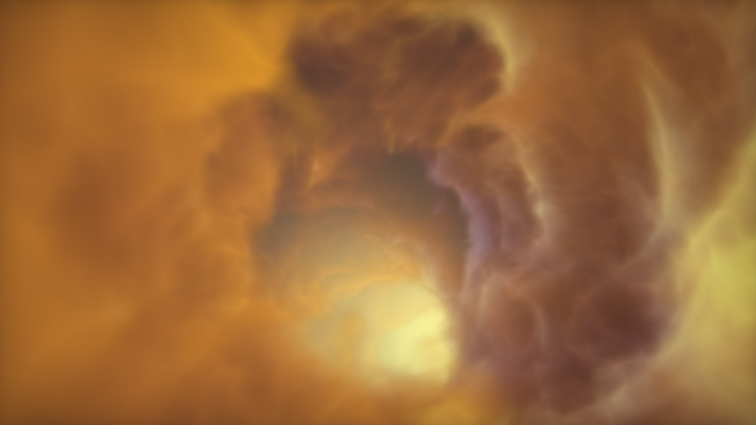
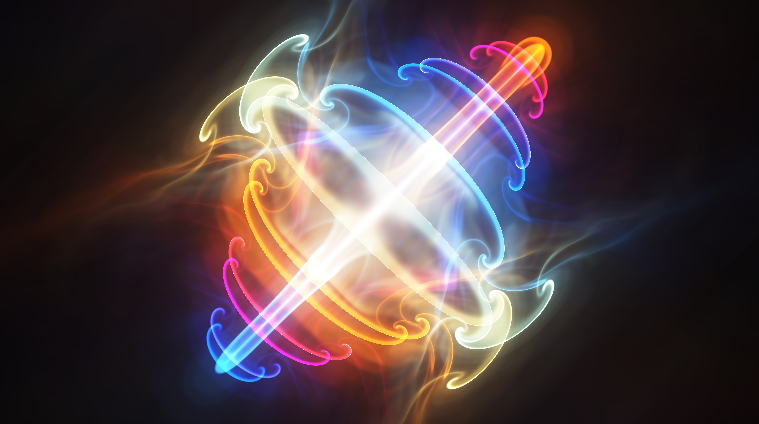
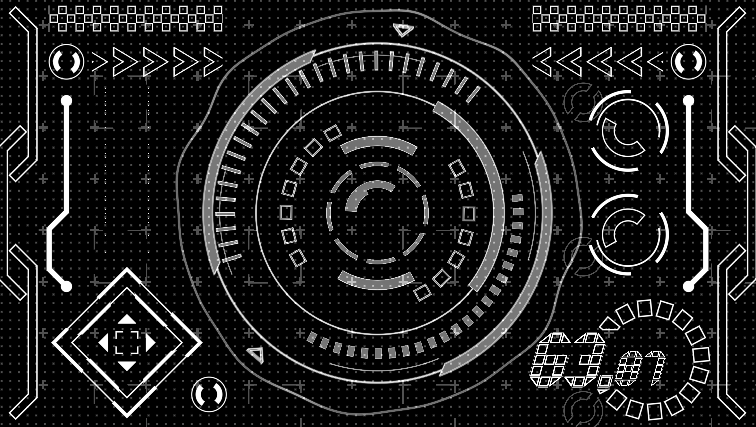
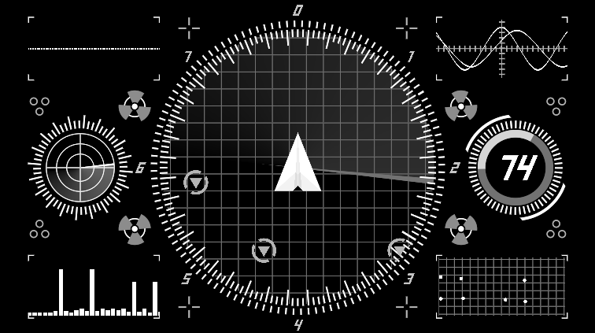
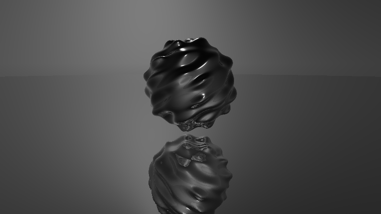
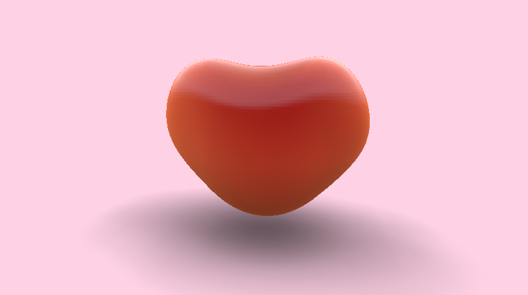
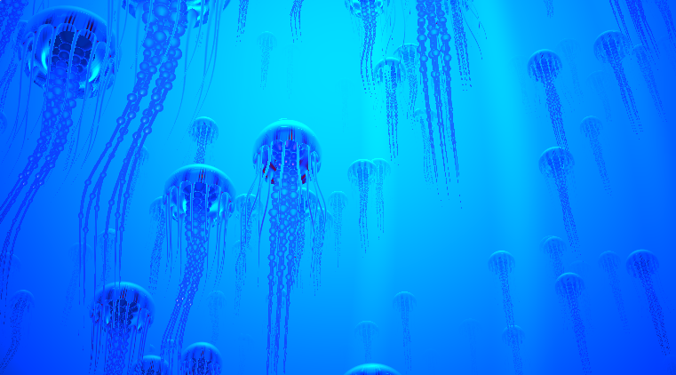

# Sparks

[English](README_en.md)

フルスクリーンGPUシェーダーデモ — Shadertoy シェーダーをネイティブモバイル (Vulkan / Metal) に移植。右上のボタンをタップしてシェーダーを切り替え。全25シェーダー。

| Sparks | Cosmic |
|:---:|:---:|
|  |  |
| **Starship** | **Clouds** |
|  |  |
| **Seascape** | **Rainforest** |
|  |  |
| **Plasma Globe** | **Grid** |
|  |  |
| **Interstellar** | **Mandelbulb** |
|  |  |
| **Cyberspace** | **Tunnel** |
|  |  |
| **Primitives** | **Fractal Pyramid** |
|  |  |
| **Palette** | **Octgrams** |
|  |  |
| **Voxel Lines** | **Mandelbulb 2** |
|  |  |
| **Protean Clouds** | **Rocaille** |
|  |  |
| **HUD Rings** | **Flight HUD** |
|  |  |
| **Chrome Metaball** | **Smooth Heart** |
|  |  |
| **Luminescence** | |
|  | |

## 対応プラットフォーム

| プラットフォーム | GPU API | 言語 | 最小バージョン |
|-----------------|---------|------|---------------|
| Android | Vulkan | Kotlin + C++/NDK | API 26 (Android 8.0) |
| iOS | Metal | Swift | iOS 15.0 |

## プロジェクト構成

```
sparks/
├── shared/shaders/     # シェーダーソース (GLSL)
│   ├── fullscreen.vert.glsl   # フルスクリーン三角形 頂点シェーダー
│   ├── sparks.frag.glsl       # シェーダー1 フラグメントシェーダー
│   ├── cosmic.frag.glsl       # シェーダー2
│   ├── starship.frag.glsl     # シェーダー3
│   ├── clouds.frag.glsl       # シェーダー4
│   ├── seascape.frag.glsl     # シェーダー5
│   ├── rainforest.frag.glsl   # シェーダー6
│   ├── plasma.frag.glsl       # シェーダー7
│   ├── grid.frag.glsl         # シェーダー8
│   ├── interstellar.frag.glsl # シェーダー9
│   ├── mandelbulb.frag.glsl   # シェーダー10
│   ├── cyberspace.frag.glsl   # シェーダー11
│   ├── tunnel.frag.glsl       # シェーダー12
│   ├── primitives.frag.glsl   # シェーダー13
│   ├── fractal.frag.glsl      # シェーダー14
│   ├── palette.frag.glsl      # シェーダー15
│   ├── octgrams.frag.glsl     # シェーダー16
│   ├── voxellines.frag.glsl   # シェーダー17
│   ├── mandelbulb2.frag.glsl  # シェーダー18
│   ├── protean.frag.glsl      # シェーダー19
│   ├── rocaille.frag.glsl     # シェーダー20
│   ├── hudrings.frag.glsl     # シェーダー21
│   ├── flighthud.frag.glsl    # シェーダー22
│   ├── metalball.frag.glsl    # シェーダー23
│   ├── heart.frag.glsl        # シェーダー24
│   ├── jellyfish.frag.glsl    # シェーダー25
│   ├── fxaa.frag.glsl         # FXAAポストプロセスシェーダー
│   └── compile_spirv.sh       # GLSL → SPIR-V コンパイルスクリプト
├── android/            # Android Studio プロジェクト (Vulkan)
└── ios/                # Xcode プロジェクト (Metal)
    └── Sparks/Shaders/
        ├── ShaderTypes.h          # 共通構造体 (VertexOut, Uniforms)
        ├── sparks.metal           # 共通頂点シェーダー + Sparks フラグメント
        ├── cosmic.metal           # Cosmic (per-file -fno-fast-math)
        ├── starship.metal         # Starship
        ├── clouds.metal           # Clouds
        ├── seascape.metal         # Seascape
        ├── rainforest.metal       # Rainforest
        ├── plasma.metal           # Plasma Globe
        ├── grid.metal             # Grid
        ├── interstellar.metal     # Interstellar
        ├── mandelbulb.metal       # Mandelbulb
        ├── cyberspace.metal       # Cyberspace
        ├── tunnel.metal           # Tunnel (per-file -fno-fast-math)
        ├── fractal.metal          # Fractal Pyramid
        ├── mandelbulb2.metal      # Mandelbulb (evilryu)
        ├── octgrams.metal         # Octgrams
        ├── palette.metal          # Palette
        ├── primitives.metal       # Primitives
        ├── voxellines.metal       # Voxel Lines
        ├── protean.metal          # Protean Clouds
        ├── rocaille.metal         # Rocaille
        ├── hudrings.metal         # HUD Rings
        ├── flighthud.metal        # Flight HUD
        ├── metalball.metal        # Chrome Metaball
        ├── heart.metal            # Smooth Heart
        └── jellyfish.metal        # Luminescence
```

## 仕組み

各エフェクトはフルスクリーン三角形上の単一フラグメントシェーダーパスで動作します。ジオメトリもパーティクルバッファも不要 — 全ピクセルが毎フレームプロシージャルに計算されます。ドラッグでカメラ/視点操作。

### 操作ボタン（右上）
| ボタン | 機能 |
|:---:|---|
| ◇ | シェーダー切替（24種類を順に切り替え） |
| ◎ | モード切替（Sparks: 視差 / Rainforest: 時間的再投影 / Mandelbulb: FXAA） |
| 1 / ½ | 半解像度トグル（½でオレンジ表示 = 縦横半分でレンダリング+アップスケール） |

### シェーダー1: Sparks
- **Voronoiベースの火花パーティクル**: アニメーションするVoronoiセルのレイヤードグリッド、各セルにブルーム付きの光る火花
- **プロシージャルスモーク**: 方向性のあるレイヤードバリューノイズ、追加ノイズで有機的な穴を生成
- **温度カラーパレット**: 白 → 黄 → 橙 → 赤 の火花グラデーション
- **15パーティクルレイヤー**: サイズ/アルファ変調で擬似3D深度を表現

### シェーダー2: Cosmic
- **反復変換**: 19回の反復ループで複雑なフラクタル的パターンを生成
- **回転行列変形**: 各反復でUV座標を回転行列で変換し、有機的な動きを実現
- **トーンマッピング**: 非線形のカラー圧縮で宇宙的な色彩を表現

### シェーダー3: Starship
- **50パーティクルループ**: 各パーティクルが独立した軌跡とフラッシュ周波数を持つ
- **テクスチャノイズ**: `stars.jpg` テクスチャをサンプリングして雲状の奥行き感を生成
- **トレイルエフェクト**: 非対称スケーリングで長い尾を持つデブリパーティクルを表現

### シェーダー4: Clouds
- **ボリュメトリックレイマーチング**: fBMノイズで密度場を定義し、レイマーチングでボリュームレンダリング
- **3Dノイズテクスチャ**: 32x32x32の3Dテクスチャでハードウェア補間による滑らかなノイズ
- **LODレイマーチ**: 距離に応じてノイズのオクターブ数を減らし、パフォーマンスを最適化
- **タッチカメラ操作**: ドラッグで視点を回転（離すと位置を保持）

### シェーダー5: Seascape
- **ハイトマップレイマーチング**: 海面の高さ関数とレイの交差を二分法で求解
- **fBMオクターブ海波**: `sea_octave` を複数スケールで重ね合わせたリアルな波形
- **フレネル反射**: 視線角度に応じた空と水面色のブレンド
- **ドラッグで時間操作**: タッチ移動でカメラの進行時間を制御

### シェーダー6: Rainforest
- **fBM地形**: 9オクターブの2Dノイズで地形高さと法線を解析的に計算
- **プロシージャル木**: 楕円体+ノイズ変形でVoronoiグリッド上に木を配置
- **ボリュメトリック雲**: y=900の雲層をレイマーチングで描画、影・ライティング付き
- **カメラアニメーション**: 時間で自動的に地形上を移動

### シェーダー7: Plasma Globe
- **ボリュメトリックレイマーチング**: 13本のレイで放電パターンをマーチング
- **フローノイズ**: fBMベースの動的ノイズで球体内部の光を表現
- **フレネル反射**: 球体表面でのリフレクションとリフラクション
- **ドラッグでカメラ回転**: タッチ移動で視点を回転

### シェーダー8: Warped Extruded Skewed Grid
- **スキューグリッド**: 大小2種のタイルをピンウィール配置でスキュー座標系に構築
- **テクスチャエクストルージョン**: テクスチャの輝度を高さマップとして各ブロックを押出
- **空間ワープ**: カメラパス+ツイストでトンネル状の空間を生成
- **グロー演出**: ランダムに光るブロックでデモシーン風の雰囲気を演出

### シェーダー9: Interstellar
- **星フィールド**: ノイズテクスチャから星の位置と深度を生成
- **ワープ速度変動**: sin/cosベースの速度変化でハイパースペース感を演出
- **RGB色シフト**: 奥行きに応じた赤・緑・青の分離で立体感を表現

### シェーダー10: Inside the Mandelbulb II
- **8次Mandelbulb SDF**: パワー8のMandelbulb距離関数をレイマーチング
- **屈折+反射**: 最大5回バウンスで内部の光の透過・反射を表現
- **ACESトーンマッピング**: 映画的な色調変換+sRGB出力
- **FXAAポストプロセス**: モード切替で2パスFXAAアンチエイリアシングを適用

### シェーダー11: Cyberspace Data Warehouse
- **六角グリッド**: 六角セルをアイソメトリックな3面タイルに変換
- **データ球体**: 各タイルにアニメーションする光るメモリ球体を配置
- **点滅ピクセル**: ノイズベースの動的データ表示パターン

### シェーダー12: Neon Tunnel
- **蛇行トンネル**: パス関数に沿って蛇行するトンネルのレイマーチング
- **ネオンライト**: 赤と青の螺旋状ネオンラインのボリュメトリックグロー
- **フラクタルテクスチャ**: ボックス状の繰り返しパターンで壁面を装飾
- **反射マーチング**: 表面反射によるスペキュラ効果

### シェーダー13: SDF Primitives
- **25種以上のSDF距離関数**: 球、箱、トーラス、カプセル、錐体、八面体、ピラミッドなど
- **バウンディングボックス最適化**: レイマーチングの効率化
- **ソフトシャドウ+AO**: チェッカーフロア付きのライティング

### シェーダー14: Fractal Pyramid
- **反復回転+abs折り畳み**: 8回の反復でフラクタル形状を生成
- **ボリュメトリックカラー**: 距離に応じたパレット加算で発光感を表現

### シェーダー15: Palette
- **IQコサインパレット**: 4回のfract反復でネストしたリング模様
- **距離ベースの発光**: pow(0.01/d, 1.2) による鮮やかなグロー

### シェーダー16: Octgrams
- **回転ボックスSDF**: 複数ボックスの組み合わせで八芒星形状を生成
- **mod空間の繰り返し**: 無限パターンのボリュメトリックグロー
- **時間変化するブルー色調**: 動的な雰囲気演出

### シェーダー17: Voxel Lines
- **DDAボクセルレイキャスト**: ノイズ地形をボクセル化してレイキャスト
- **ワイヤーフレーム+エッジグロー**: ボクセルAO付きの光るエッジ表現
- **カラー/モノクロ切替**: 周期的な色調変化

### シェーダー18: Mandelbulb (evilryu)
- **8次Mandelbulb SDF**: オーバーステッピング最適化のレイマーチング
- **ソフトシャドウ**: 自動回転カメラ+距離ベースカラーマッピング
- **ポストプロセス**: ガンマ、コントラスト、彩度、ビネット

### シェーダー19: Protean Clouds
- **変形周期グリッド**: テクスチャ不要のプロシージャルボリュームノイズ
- **動的ステップサイズ**: 密度に基づく適応的マーチングで高速化
- **彩度保持補間**: iLerpによるカラーブレンド

### シェーダー20: Rocaille
- **二重ループタービュレンス**: 9レイヤー×9回のsin変形で複雑な模様を生成
- **コサインカラーリング+tanhトーンマッピング**: コンパクトで美しいエフェクト

### シェーダー21: HUD Rings
- **7リングのレイヤードSDF**: 異なる回転速度の同心リングをz方向に並べてレイマーチング
- **7セグ風プロシージャルフォント**: mod空間のグリッド+SDF合成で桁を動的に描画
- **UIオーバーレイ群**: 矩形・三角・グラフ・矢印・サイドラインなど複数のHUDパーツを重ね合わせ
- **30秒循環アニメーション**: `cubicInOut` イージングでカメラ角度とリング厚みが周期的に変化

### シェーダー22: Flight HUD
- **レーダー表示**: 回転スイープ線+極座標グリッド+数字付き目盛りのレーダーUI
- **紙飛行機オーバーレイ**: 三角形SDFの組合せで折り紙風の機体を描画
- **4種のグラフパネル**: バーグラフ・ヒストグラム・波形・ドットプロット
- **複数の小型UI**: 回転リングゲージ・十字照準・スキュー7セグ数字

### シェーダー23: Chrome Metaball
- **メタボールSDF**: 球面調和変形+地面との smooth union で有機的な形状を生成
- **PBRライティング**: GGX NDF + Smith-GGX Visibility + Schlick Fresnel の物理ベースBRDF
- **5回反射**: extinction ベースの多重反射でクロム質感を表現
- **11秒ループアニメーション**: バウンス・変形・カメラ軌道を `smoothstep` キーフレームで制御

### シェーダー24: Smooth Heart
- **almostIdentity関数**: ミラー軸の曲率不連続をスムージングし滑らかなハート形状を生成
- **64サンプルAO**: 球面フィボナッチ分布による高品質アンビエントオクルージョン
- **フレネル反射+環境照明**: 表面角度に応じた反射色変化とスカイライトブレンド
- **マウスインタラクション**: x軸でカメラ回転、y軸でスムージング量を制御

### シェーダー25: Luminescence
- **繰り返しグリッド配置**: セル分割で無数のクラゲを生成するプロシージャルシーン
- **ボリュメトリックテクスチャ**: 傘内部の発光パターンを8ステップのボリュームサンプリングで描画
- **極座標タッチパターン**: pModPolarで6本の内側触手と13本の外側触手を生成
- **ポンプアニメーション+うねり**: 傘の拍動と触手のsin波スウェイで有機的な動きを表現

Uniform は `iResolution` (vec2)、`iTime` (float)、`iMouse` (vec4)、`mode` (int)。シェーダー3/4/7/8/9/17はテクスチャも使用。

## ビルド

### Android

1. [Vulkan SDK](https://vulkan.lunarg.com/) をインストール（`glslangValidator` に必要）
2. シェーダーをコンパイル:
   ```bash
   cd shared/shaders
   bash compile_spirv.sh
   ```
3. `android/` を Android Studio で開く
4. Vulkan対応の実機にビルド・デプロイ

### iOS

1. `ios/Sparks.xcodeproj` を Xcode で開く
2. 実機をターゲットに選択
3. ビルド・実行 (Cmd+R)

## クレジット

| # | シェーダー | 作者 | 説明 | ライセンス |
|---|-----------|------|------|-----------|
| 1 | [Sparks](https://www.shadertoy.com/view/4tXXzj) | Jan Mróz (jaszunio15) | Voronoiパーティクル+プロシージャルスモークの炎の火花 | CC BY 3.0 |
| 2 | [Cosmic](https://www.shadertoy.com/view/XXyGzh) | Nguyen2007 | 反復変換による宇宙的アブストラクトエフェクト | CC BY-NC-SA 3.0 |
| 3 | [Starship](https://www.shadertoy.com/view/l3cfW4) | @XorDev | テクスチャベースの宇宙船デブリパーティクルトレイル | CC BY-NC-SA 3.0 |
| 4 | [Clouds](https://www.shadertoy.com/view/XslGRr) | Inigo Quilez | 3Dノイズによるボリュメトリック雲のレイマーチング | 教育目的のみ |
| 5 | [Seascape](https://www.shadertoy.com/view/Ms2SD1) | Alexander Alekseev (TDM) | fBM海波のハイトマップレイマーチング | CC BY-NC-SA 3.0 |
| 6 | [Rainforest](https://www.shadertoy.com/view/4ttSWf) | Inigo Quilez | fBM地形・木・雲によるプロシージャル熱帯雨林 | 教育目的のみ |
| 7 | [Plasma Globe](https://www.shadertoy.com/view/XsjXRm) | nimitz (@stormoid) | ボリュメトリックレイマーチングのプラズマグローブ | CC BY-NC-SA 3.0 |
| 8 | [Grid](https://www.shadertoy.com/view/wtfBDf) | Shane | スキューグリッドエクストルージョンのデモシーン風トンネル | CC BY-NC-SA 3.0 |
| 9 | [Interstellar](https://www.shadertoy.com/view/Xdl3D2) | Hazel Quantock | ノイズテクスチャベースの星間ワープエフェクト | CC0 |
| 10 | [Mandelbulb](https://www.shadertoy.com/view/mtScRc) | mrange | 8次Mandelbulbフラクタル内部探索+FXAA | CC0 |
| 11 | [Cyberspace](https://www.shadertoy.com/view/NlK3Wt) | bitless | 六角グリッド上のサイバースペースデータウェアハウス | CC BY-NC-SA 3.0 |
| 12 | [Neon Tunnel](https://www.shadertoy.com/view/scS3Wm) | — | ネオンライト付きトンネルのレイマーチング+反射 | CC BY-NC-SA 3.0 |
| 13 | [Primitives](https://www.shadertoy.com/view/Xds3zN) | Inigo Quilez | 25種以上のSDF距離関数ショーケース | MIT |
| 14 | [Fractal Pyramid](https://www.shadertoy.com/view/tsXBzS) | — | 反復回転+abs折り畳みのフラクタル形状 | CC BY-NC-SA 3.0 |
| 15 | [Palette](https://www.shadertoy.com/view/mtyGWy) | — | IQコサインパレットによるフラクタルリング | CC BY-NC-SA 3.0 |
| 16 | [Octgrams](https://www.shadertoy.com/view/tlVGDt) | — | 回転ボックスSDFの八芒星パターン | CC BY-NC-SA 3.0 |
| 17 | [Voxel Lines](https://www.shadertoy.com/view/4dfGzs) | Inigo Quilez | DDAボクセルレイキャスト+ワイヤーフレームグロー | 教育目的のみ |
| 18 | [Mandelbulb](https://www.shadertoy.com/view/MdXSWn) | evilryu | 8次Mandelbulb+オーバーステッピング最適化 | CC BY-NC-SA 3.0 |
| 19 | [Protean Clouds](https://www.shadertoy.com/view/3l23Rh) | nimitz (@stormoid) | 変形周期グリッドのプロシージャル雲 | CC BY-NC-SA 3.0 |
| 20 | [Rocaille](https://www.shadertoy.com/view/WXyczK) | @XorDev | タービュレンス多層レイヤーの装飾模様 | CC BY-NC-SA 3.0 |
| 21 | [HUD Rings](https://www.shadertoy.com/view/Dsf3WH) | kishimisu | 回転リング群+7セグ風数字+HUD装飾のメカUIレイマーチング | CC BY-NC-SA 3.0 |
| 22 | [Flight HUD](https://www.shadertoy.com/view/Dl2XRz) | kishimisu | レーダー+紙飛行機+グラフ群のフライト風2D HUD | CC BY-NC-SA 3.0 |
| 23 | [Chrome Metaball](https://www.shadertoy.com/view/7dtSDf) | — | PBR+多重反射のクロムメタボール | CC BY-NC-SA 3.0 |
| 24 | [Smooth Heart](https://www.shadertoy.com/view/4lByWK) | iq原作ベース | almostIdentityで滑らかな曲率のハートレイマーチング | CC BY-NC-SA 3.0 |
| 25 | [Luminescence](https://www.shadertoy.com/view/4sXBRn) | Martijn Steinrucken (BigWings) | 繰り返しグリッド上のクラゲ群のボリュメトリックレイマーチング | CC BY-NC-SA 3.0 |
