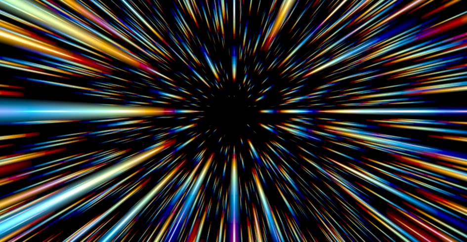

# Sparks

[English](README_en.md)

フルスクリーンGPUシェーダーデモ — Shadertoy シェーダーをネイティブモバイル (Vulkan / Metal) に移植。画面タップでシェーダーを切り替え。

| Sparks | Cosmic |
|:---:|:---:|
|  |  |
| **Starship** | **Clouds** |
|  |  |
| **Seascape** | **Rainforest** |
|  |  |
| **Plasma Globe** | **Grid** |
|  |  |
| **Interstellar** | **Mandelbulb** |
|  |  |

- **シェーダー1**: Jan Mróz (jaszunio15) 氏の [Sparks](https://www.shadertoy.com/view/4tXXzj) — レイヤードVoronoiパーティクルとプロシージャルスモークによる炎の火花。ライセンス: CC BY 3.0。
- **シェーダー2**: Nguyen2007 氏の [Cosmic](https://www.shadertoy.com/view/XXyGzh) — プロシージャルな宇宙的アブストラクトエフェクト。ライセンス: CC BY-NC-SA 3.0。
- **シェーダー3**: @XorDev 氏の [Starship](https://www.shadertoy.com/view/l3cfW4) — テクスチャベースのパーティクルトレイルによる宇宙船デブリエフェクト。ライセンス: CC BY-NC-SA 3.0。
- **シェーダー4**: Inigo Quilez 氏の [Clouds](https://www.shadertoy.com/view/XslGRr) — 3Dノイズによるボリュメトリック雲のレイマーチング。ライセンス: 教育目的のみ。
- **シェーダー5**: Alexander Alekseev (TDM) 氏の [Seascape](https://www.shadertoy.com/view/Ms2SD1) — プロシージャル海面のハイトマップレイマーチング。ライセンス: CC BY-NC-SA 3.0。
- **シェーダー6**: Inigo Quilez 氏の [Rainforest](https://www.shadertoy.com/view/4ttSWf) — fBM地形・木・雲によるプロシージャル熱帯雨林。ライセンス: 教育目的のみ。
- **シェーダー7**: nimitz 氏の [Plasma Globe](https://www.shadertoy.com/view/XsjXRm) — ボリュメトリックレイマーチングによるプラズマグローブ。ライセンス: CC BY-NC-SA 3.0。
- **シェーダー8**: Shane 氏の [Warped Extruded Skewed Grid](https://www.shadertoy.com/view/wtfBDf) — スキューグリッドのエクストルージョンによるデモシーン風トンネル。ライセンス: CC BY-NC-SA 3.0。
- **シェーダー9**: Hazel Quantock 氏の [Interstellar](https://www.shadertoy.com/view/Xdl3D2) — ノイズテクスチャベースの星間ワープエフェクト。ライセンス: CC0 (パブリックドメイン)。
- **シェーダー10**: mrange 氏の [Inside the Mandelbulb II](https://www.shadertoy.com/view/mtScRc) — 8次Mandelbulbフラクタルの内部探索+FXAA。ライセンス: CC0 (パブリックドメイン)。

## 対応プラットフォーム

| プラットフォーム | GPU API | 言語 | 最小バージョン |
|-----------------|---------|------|---------------|
| Android | Vulkan | Kotlin + C++/NDK | API 26 (Android 8.0) |
| iOS | Metal | Swift | iOS 15.0 |

## プロジェクト構成

```
sparks/
├── shared/shaders/     # シェーダーソース (GLSL + MSL)
│   ├── fullscreen.vert.glsl   # フルスクリーン三角形 頂点シェーダー
│   ├── sparks.frag.glsl       # シェーダー1 フラグメントシェーダー (Vulkan)
│   ├── cosmic.frag.glsl       # シェーダー2 フラグメントシェーダー (Vulkan)
│   ├── starship.frag.glsl     # シェーダー3 フラグメントシェーダー (Vulkan)
│   ├── clouds.frag.glsl       # シェーダー4 フラグメントシェーダー (Vulkan)
│   ├── seascape.frag.glsl     # シェーダー5 フラグメントシェーダー (Vulkan)
│   ├── rainforest.frag.glsl   # シェーダー6 フラグメントシェーダー (Vulkan)
│   ├── plasma.frag.glsl       # シェーダー7 フラグメントシェーダー (Vulkan)
│   ├── grid.frag.glsl         # シェーダー8 フラグメントシェーダー (Vulkan)
│   ├── interstellar.frag.glsl # シェーダー9 フラグメントシェーダー (Vulkan)
│   ├── mandelbulb.frag.glsl   # シェーダー10 フラグメントシェーダー (Vulkan)
│   ├── fxaa.frag.glsl         # FXAAポストプロセスシェーダー (Vulkan)
│   └── compile_spirv.sh       # GLSL → SPIR-V コンパイルスクリプト
├── android/            # Android Studio プロジェクト (Vulkan)
└── ios/                # Xcode プロジェクト (Metal)
    └── Sparks/Shaders/
        ├── ShaderTypes.h          # 共通構造体 (VertexOut, Uniforms)
        ├── sparks.metal           # 共通頂点シェーダー + Sparks フラグメント
        ├── cosmic.metal           # Cosmic フラグメントシェーダー
        ├── starship.metal         # Starship フラグメントシェーダー
        ├── clouds.metal           # Clouds フラグメントシェーダー
        ├── seascape.metal         # Seascape フラグメントシェーダー
        ├── rainforest.metal       # Rainforest フラグメントシェーダー
        ├── plasma.metal           # Plasma Globe フラグメントシェーダー
        └── grid.metal             # Grid フラグメントシェーダー
```

## 仕組み

各エフェクトはフルスクリーン三角形上の単一フラグメントシェーダーパスで動作します。ジオメトリもパーティクルバッファも不要 — 全ピクセルが毎フレームプロシージャルに計算されます。右上のボタンで10個のシェーダーを切り替えられます。ドラッグでカメラ/視点操作。

### シェーダー1: Sparks
- **Voronoiベースの火花パーティクル**: アニメーションするVoronoiセルのレイヤードグリッド、各セルにブルーム付きの光る火花
- **プロシージャルスモーク**: 方向性のあるレイヤードバリューノイズ、追加ノイズで有機的な穴を生成
- **温度カラーパレット**: 白 → 黄 → 橙 → 赤 の火花グラデーション
- **15パーティクルレイヤー**: サイズ/アルファ変調で擬似3D深度を表現

### シェーダー2: Cosmic
- **反復変換**: 19回の反復ループで複雑なフラクタル的パターンを生成
- **回転行列変形**: 各反復でUV座標を回転行列で変換し、有機的な動きを実現
- **トーンマッピング**: 非線形のカラー圧縮で宇宙的な色彩を表現

### シェーダー3: Starship
- **50パーティクルループ**: 各パーティクルが独立した軌跡とフラッシュ周波数を持つ
- **テクスチャノイズ**: `stars.jpg` テクスチャをサンプリングして雲状の奥行き感を生成
- **トレイルエフェクト**: 非対称スケーリングで長い尾を持つデブリパーティクルを表現

### シェーダー4: Clouds
- **ボリュメトリックレイマーチング**: fBMノイズで密度場を定義し、レイマーチングでボリュームレンダリング
- **3Dノイズテクスチャ**: 32x32x32の3Dテクスチャでハードウェア補間による滑らかなノイズ
- **LODレイマーチ**: 距離に応じてノイズのオクターブ数を減らし、パフォーマンスを最適化
- **タッチカメラ操作**: ドラッグで視点を回転（離すと位置を保持）

### シェーダー5: Seascape
- **ハイトマップレイマーチング**: 海面の高さ関数とレイの交差を二分法で求解
- **fBMオクターブ海波**: `sea_octave` を複数スケールで重ね合わせたリアルな波形
- **フレネル反射**: 視線角度に応じた空と水面色のブレンド
- **ドラッグで時間操作**: タッチ移動でカメラの進行時間を制御

### シェーダー6: Rainforest
- **fBM地形**: 9オクターブの2Dノイズで地形高さと法線を解析的に計算
- **プロシージャル木**: 楕円体+ノイズ変形でVoronoiグリッド上に木を配置
- **ボリュメトリック雲**: y=900の雲層をレイマーチングで描画、影・ライティング付き
- **カメラアニメーション**: 時間で自動的に地形上を移動

### シェーダー7: Plasma Globe
- **ボリュメトリックレイマーチング**: 13本のレイで放電パターンをマーチング
- **フローノイズ**: fBMベースの動的ノイズで球体内部の光を表現
- **フレネル反射**: 球体表面でのリフレクションとリフラクション
- **ドラッグでカメラ回転**: タッチ移動で視点を回転

### シェーダー8: Warped Extruded Skewed Grid
- **スキューグリッド**: 大小2種のタイルをピンウィール配置でスキュー座標系に構築
- **テクスチャエクストルージョン**: テクスチャの輝度を高さマップとして各ブロックを押出
- **空間ワープ**: カメラパス+ツイストでトンネル状の空間を生成
- **グロー演出**: ランダムに光るブロックでデモシーン風の雰囲気を演出

### シェーダー9: Interstellar
- **星フィールド**: ノイズテクスチャから星の位置と深度を生成
- **ワープ速度変動**: sin/cosベースの速度変化でハイパースペース感を演出
- **RGB色シフト**: 奥行きに応じた赤・緑・青の分離で立体感を表現

### シェーダー10: Inside the Mandelbulb II
- **8次Mandelbulb SDF**: パワー8のMandelbulb距離関数をレイマーチング
- **屈折+反射**: 最大5回バウンスで内部の光の透過・反射を表現
- **ACESトーンマッピング**: 映画的な色調変換+sRGB出力
- **FXAAポストプロセス**: モード切替で2パスFXAAアンチエイリアシングを適用

Uniform は `iResolution` (vec2)、`iTime` (float)、`iMouse` (vec4)、`mode` (int)。シェーダー3/4/7/8/9はテクスチャも使用。

## ビルド

### Android

1. [Vulkan SDK](https://vulkan.lunarg.com/) をインストール（`glslangValidator` に必要）
2. シェーダーをコンパイル:
   ```bash
   cd shared/shaders
   bash compile_spirv.sh
   ```
3. `android/` を Android Studio で開く
4. Vulkan対応の実機にビルド・デプロイ

### iOS

1. `ios/Sparks.xcodeproj` を Xcode で開く
2. 実機をターゲットに選択
3. ビルド・実行 (Cmd+R)

## クレジット

- シェーダー1: [Jan Mróz (jaszunio15)](https://www.shadertoy.com/user/jaszunio15) — CC BY 3.0
- シェーダー2: [Nguyen2007](https://www.shadertoy.com/view/XXyGzh) — CC BY-NC-SA 3.0
- シェーダー3: [@XorDev](https://www.shadertoy.com/view/l3cfW4) — CC BY-NC-SA 3.0
- シェーダー4: [Inigo Quilez](https://www.shadertoy.com/view/XslGRr) — 教育目的のみ（再配布不可）
- シェーダー5: [Alexander Alekseev (TDM)](https://www.shadertoy.com/view/Ms2SD1) — CC BY-NC-SA 3.0
- シェーダー6: [Inigo Quilez](https://www.shadertoy.com/view/4ttSWf) — 教育目的のみ（再配布不可）
- シェーダー7: [nimitz (@stormoid)](https://www.shadertoy.com/view/XsjXRm) — CC BY-NC-SA 3.0
- シェーダー8: [Shane](https://www.shadertoy.com/view/wtfBDf) — CC BY-NC-SA 3.0
- シェーダー9: [Hazel Quantock](https://www.shadertoy.com/view/Xdl3D2) — CC0 (パブリックドメイン)
- シェーダー10: [mrange](https://www.shadertoy.com/view/mtScRc) — CC0 (パブリックドメイン)
