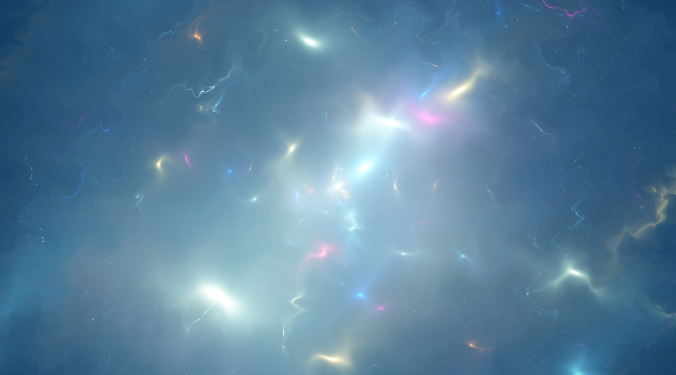
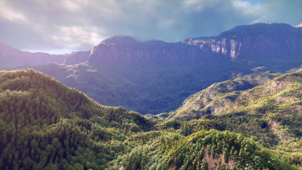

# Sparks

[Japanese (日本語)](README.md)

Fullscreen GPU shader demo — Shadertoy shaders ported to native mobile (Vulkan / Metal). Tap to switch shaders.

| Shader 1: Sparks | Shader 2: Cosmic |
|:---:|:---:|
|  |  |
| **Shader 3: Starship** | **Shader 4: Clouds** |
|  |  |
| **Shader 5: Seascape** | **Shader 6: Rainforest** |
|  |  |
| **Shader 7: Plasma Globe** | |
|  | |

- **Shader 1**: [Sparks](https://www.shadertoy.com/view/4tXXzj) by Jan Mróz (jaszunio15) — Layered Voronoi particles with procedural smoke fire sparks. License: CC BY 3.0.
- **Shader 2**: [Cosmic](https://www.shadertoy.com/view/XXyGzh) by Nguyen2007 — Procedural cosmic abstract effect. License: CC BY-NC-SA 3.0.
- **Shader 3**: [Starship](https://www.shadertoy.com/view/l3cfW4) by @XorDev — Texture-based particle trails for spaceship debris. License: CC BY-NC-SA 3.0.
- **Shader 4**: [Clouds](https://www.shadertoy.com/view/XslGRr) by Inigo Quilez — Volumetric cloud raymarching with 3D noise. License: Educational use only.
- **Shader 5**: [Seascape](https://www.shadertoy.com/view/Ms2SD1) by Alexander Alekseev (TDM) — Procedural ocean heightmap raymarching. License: CC BY-NC-SA 3.0.
- **Shader 6**: [Rainforest](https://www.shadertoy.com/view/4ttSWf) by Inigo Quilez — Procedural rainforest with fBM terrain, trees and volumetric clouds. License: Educational use only.
- **Shader 7**: [Plasma Globe](https://www.shadertoy.com/view/XsjXRm) by nimitz (@stormoid) — Volumetric raymarched plasma globe with flow noise. License: CC BY-NC-SA 3.0.

## Supported Platforms

| Platform | GPU API | Language | Minimum Version |
|----------|---------|----------|-----------------|
| Android | Vulkan | Kotlin + C++/NDK | API 26 (Android 8.0) |
| iOS | Metal | Swift | iOS 15.0 |

## Project Structure

```
sparks/
├── shared/shaders/     # Shader sources (GLSL + MSL)
│   ├── fullscreen.vert.glsl   # Fullscreen triangle vertex shader
│   ├── sparks.frag.glsl       # Shader 1 fragment shader (Vulkan)
│   ├── cosmic.frag.glsl       # Shader 2 fragment shader (Vulkan)
│   ├── starship.frag.glsl     # Shader 3 fragment shader (Vulkan)
│   ├── clouds.frag.glsl       # Shader 4 fragment shader (Vulkan)
│   ├── seascape.frag.glsl     # Shader 5 fragment shader (Vulkan)
│   ├── rainforest.frag.glsl   # Shader 6 fragment shader (Vulkan)
│   ├── plasma.frag.glsl       # Shader 7 fragment shader (Vulkan)
│   ├── sparks.metal           # Metal vertex + fragment shaders (all shaders)
│   └── compile_spirv.sh       # GLSL to SPIR-V compilation script
├── android/            # Android Studio project (Vulkan)
└── ios/                # Xcode project (Metal)
```

## How It Works

Each effect runs as a single fragment shader pass on a fullscreen triangle. No geometry or particle buffers needed — every pixel is computed procedurally each frame. Use the top-right button to cycle through 7 shaders. Drag to control camera/viewpoint.

### Shader 1: Sparks
- **Voronoi-based spark particles**: Layered grid of animated Voronoi cells, each with a glowing bloom spark
- **Procedural smoke**: Directional layered value noise with organic holes
- **Temperature color palette**: White to yellow to orange to red gradient
- **15 particle layers**: Size/alpha modulation for pseudo-3D depth

### Shader 2: Cosmic
- **Iterative transforms**: 19-iteration loop generating complex fractal-like patterns
- **Rotation matrix warping**: UV coordinates rotated per iteration for organic motion
- **Tone mapping**: Nonlinear color compression for cosmic color palette

### Shader 3: Starship
- **50 particle loop**: Each particle with independent trajectory and flash frequency
- **Texture noise**: `stars.jpg` texture sampling for cloudy depth effect
- **Trail effect**: Asymmetric scaling for long-tailed debris particles

### Shader 4: Clouds
- **Volumetric raymarching**: fBM noise density field with volume rendering
- **3D noise texture**: 32x32x32 3D texture with hardware-interpolated smooth noise
- **LOD raymarching**: Reduces noise octaves with distance for performance
- **Touch camera control**: Drag to rotate viewpoint (holds position on release)

### Shader 5: Seascape
- **Heightmap raymarching**: Bisection method for ray-ocean surface intersection
- **fBM octave waves**: Multiple scales of `sea_octave` for realistic wave shapes
- **Fresnel reflection**: View-angle-dependent sky and water color blending
- **Drag time control**: Touch movement controls camera time progression

### Shader 7: Plasma Globe
- **Volumetric raymarching**: 13 rays march through discharge patterns
- **Flow noise**: fBM-based dynamic noise for inner sphere illumination
- **Fresnel reflection**: Reflection and refraction on the sphere surface
- **Drag camera rotation**: Touch movement rotates the viewpoint

### Shader 6: Rainforest
- **fBM terrain**: 9-octave 2D noise for terrain height with analytical normals
- **Procedural trees**: Ellipsoids with noise distortion placed on a Voronoi grid
- **Volumetric clouds**: Cloud layer at y=900 raymarched with shadows and lighting
- **Camera animation**: Automatic movement over the terrain surface

Uniforms: `iResolution` (vec2), `iTime` (float), `iMouse` (vec4), `mode` (int). Shaders 3/4 also use textures.

## Build

### Android

1. Install [Vulkan SDK](https://vulkan.lunarg.com/) (needed for `glslangValidator`)
2. Compile shaders:
   ```bash
   cd shared/shaders
   bash compile_spirv.sh
   ```
3. Open `android/` in Android Studio
4. Build and deploy to a Vulkan-capable device

### iOS

1. Open `ios/Sparks.xcodeproj` in Xcode
2. Select a physical device as target
3. Build and run (Cmd+R)

## Credits

- Shader 1: [Jan Mróz (jaszunio15)](https://www.shadertoy.com/user/jaszunio15) — CC BY 3.0
- Shader 2: [Nguyen2007](https://www.shadertoy.com/view/XXyGzh) — CC BY-NC-SA 3.0
- Shader 3: [@XorDev](https://www.shadertoy.com/view/l3cfW4) — CC BY-NC-SA 3.0
- Shader 4: [Inigo Quilez](https://www.shadertoy.com/view/XslGRr) — Educational use only (no redistribution)
- Shader 5: [Alexander Alekseev (TDM)](https://www.shadertoy.com/view/Ms2SD1) — CC BY-NC-SA 3.0
- Shader 6: [Inigo Quilez](https://www.shadertoy.com/view/4ttSWf) — Educational use only (no redistribution)
- Shader 7: [nimitz (@stormoid)](https://www.shadertoy.com/view/XsjXRm) — CC BY-NC-SA 3.0
